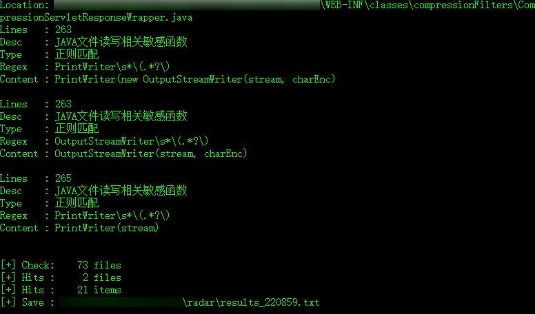

# radar

> 一个基于正则匹配的简易代码敏感函数与关键字查找脚本


- ##### 基于可配置的 json 文件规则

- ##### 目前仅有 java 语言规则

- ##### 可用作 Webshell 查找和快速代码审计辅助


#### 使用方法:

```python
> python radar.py -h

usage: radar.py [-h] [-d DST] [-c LANGUAGE] [-e EXT] [-r RULE]
                [-w [file_path]] [-n]

optional arguments:
  -h, --help      show this help message and exit
  -d DST          Directory or Single File Path
  -c LANGUAGE     code language rule,such as[common,java], default: [java]
  -e EXT          file extension, default: [all] or set [jsp,jspx,java]
  -r RULE         rules path, default: [rules.json]
  -w [file_path]  set result save path, default:[results_datetime.txt]
  -n, --no-print  don't print the result
```


#### 使用示例:

```python
# 检查单个文件
python radar.py -c java -d /code/webshell.jsp

# 检查文件夹下后缀为 jsp jspx java 的文件
python radar.py -c java -e jsp,jspx,java -d /code/for/check
```

#### 

#### 使用截图:



